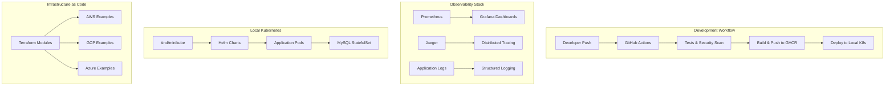

# DevOps/Platform Engineering Portfolio Enhancement Plan

## Project Overview
Transform the maintenance API project into a comprehensive Platform Engineering/SRE portfolio showcase targeting observability and scalability roles.

## Current Project Strengths
- ✅ Go-based REST API with proper structure
- ✅ Docker containerization with multi-stage builds
- ✅ Docker Compose for local development
- ✅ Unit and integration testing
- ✅ Makefile for automation
- ✅ Hot-reloading with Air
- ✅ Database initialization scripts
- ✅ Linting and code quality tools

## Enhancement Plan

### 🔄 **GitHub Actions & Free Services**
- **CI/CD Pipeline**: Multi-stage workflow with testing, building, security scanning
- **Container Registry**: GitHub Container Registry for image storage
- **Secrets Management**: GitHub Secrets for sensitive configuration
- **Automated Releases**: Semantic versioning and automated changelog generation

### 🔍 **Observability Stack (Free/Local)**
- **Metrics**: Prometheus with custom business metrics
- **Visualization**: Grafana dashboards for SLI/SLO monitoring
- **Tracing**: Jaeger for distributed tracing
- **Logging**: Structured JSON logging with ELK stack (local)

### 🚀 **Cloud-Native Architecture (Local + Documentation)**
- **Kubernetes**: Local deployment with kind/minikube
- **Helm**: Charts for configuration management
- **Service Mesh**: Istio configuration examples (documentation)
- **Ingress**: NGINX ingress controller setup

### 🏗️ **Infrastructure as Code (Examples)**
- **Terraform**: Well-documented modules for major cloud providers
- **Kubernetes Manifests**: Production-ready YAML configurations
- **Helm Values**: Environment-specific configurations
- **GitOps**: ArgoCD configuration examples

### 📊 **Reliability Engineering**
- **SLI/SLO**: Define service level objectives with Prometheus
- **Alerting**: AlertManager configuration with escalation policies
- **Load Testing**: k6 scripts for performance validation
- **Monitoring**: Comprehensive dashboards and runbooks

### 🛡️ **Security & Compliance**
- **Container Scanning**: Trivy integration in GitHub Actions
- **Dependency Scanning**: Snyk free tier for vulnerability detection
- **SAST**: CodeQL analysis in GitHub Actions
- **RBAC**: Kubernetes role-based access control examples

## Implementation Phases

### **Phase 1 - Foundation (Weeks 1-2):**
1. GitHub Actions CI/CD pipeline
2. GitHub Container Registry setup
3. Health checks and graceful shutdown
4. Structured logging implementation

### **Phase 2 - Observability (Weeks 3-4):**
5. Prometheus metrics and alerting
6. Grafana dashboards
7. Jaeger distributed tracing
8. SLI/SLO definitions

### **Phase 3 - Cloud-Native (Weeks 5-6):**
9. Kubernetes manifests
10. Helm charts
11. Load testing with k6
12. Security scanning integration

### **Phase 4 - Documentation & IaC (Weeks 7-8):**
13. Terraform examples
14. Operational documentation
15. Disaster recovery procedures
16. Configuration management

## Architecture Overview

## Portfolio Impact

### **What This Will Demonstrate:**

**Platform Engineering Skills:**
- **Developer Experience**: Self-service deployment with Helm charts and automated CI/CD
- **Infrastructure Abstraction**: Kubernetes manifests that work across environments
- **Tooling & Automation**: Comprehensive GitHub Actions workflows and Makefile automation
- **Standards & Governance**: Security scanning, code quality gates, and compliance checks

**SRE Skills:**
- **Observability**: Full monitoring stack with metrics, logs, and traces
- **Reliability**: SLI/SLO definitions, alerting, and incident response procedures
- **Performance**: Load testing, benchmarking, and capacity planning
- **Security**: Vulnerability scanning, secrets management, and security policies

## Key Differentiators

1. **Production-Ready Practices**: Not just a demo app, but enterprise-grade operational practices
2. **Cost-Conscious Architecture**: Shows understanding of business constraints while maintaining quality
3. **Comprehensive Observability**: Demonstrates deep understanding of system reliability
4. **Security-First Approach**: Built-in security scanning and compliance checks
5. **Documentation Excellence**: Operational runbooks and disaster recovery procedures

## Task Checklist

- [ ] Set up GitHub Actions CI/CD pipeline with multi-stage workflow
- [ ] Add GitHub Container Registry for image publishing
- [ ] Implement comprehensive observability with free tools (Prometheus, Grafana, Jaeger)
- [ ] Create Kubernetes manifests for local deployment (kind/minikube)
- [ ] Add Helm charts for application packaging
- [ ] Implement structured logging with correlation IDs and metrics
- [ ] Add health checks, readiness probes, and graceful shutdown
- [ ] Create SLI/SLO definitions and alerting rules with Prometheus
- [ ] Add load testing with k6 and performance benchmarking
- [ ] Implement security scanning in CI/CD (Trivy, Snyk free tier)
- [ ] Create Terraform examples for AWS/GCP/Azure (documentation only)
- [ ] Add comprehensive operational documentation and runbooks
- [ ] Implement configuration management with Kubernetes ConfigMaps/Secrets
- [ ] Create disaster recovery procedures and backup strategies documentation
- [ ] Add monitoring dashboards and alerting rules

---

*This plan transforms your maintenance API from a simple application into a showcase of modern Platform Engineering and SRE practices, making it highly attractive to employers in those fields.*